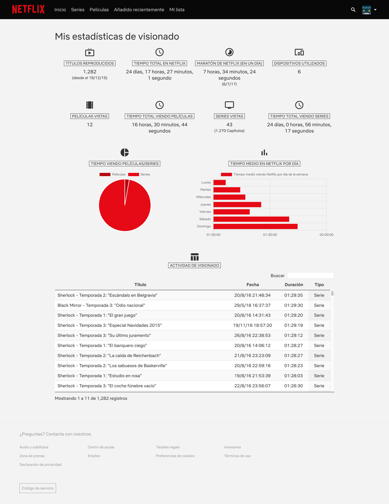

# Netflix Usage Stats

This Chrome extension helps you to know about your usage stats when you are watching Netflix. It includes a set of statistics

* Total watched elements (movie, show, trailer)
* Total time spent on Netflix
* Netlix marathon (maximum time watching Netflix in a day)
* Number of devices you have used to watch Netflix
* Number of movies watched
* Time spent watching movies
* Number of movies watched
* Time spent watching shows
* Time watching movies vs time watching shows
* Percentage of time watching Netflix by day of the week

## Getting Started

1. Open the Extension Management page by navigating to [chrome://extensions](chrome://extensions).
The Extension Management page can also be opened by clicking on the Chrome menu, hovering over `More Tools` then selecting `Extensions`.
2. Enable `Developer Mode` by clicking the toggle switch next to Developer mode.
3. Click the `Load Unpacked` button and select the extension directory.

## Build

You can generate a zip file with the extension ready to be uploaded to [Google Chrome Developer Dashboard](https://chrome.google.com/webstore/devconsole)

Just execute `npm run build` and a zip called `netflix-usage-stats.zip` will be generated.
