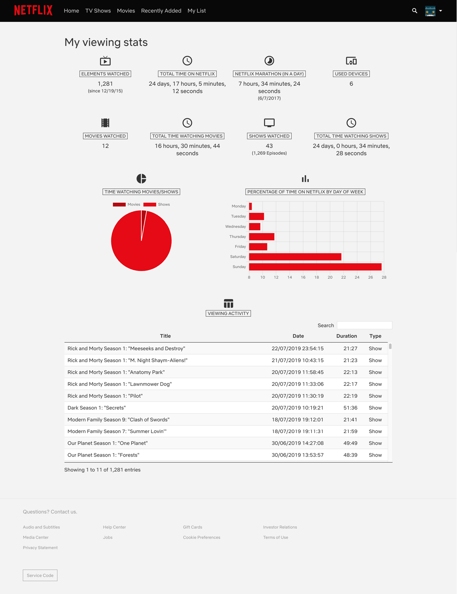

  

  <h1 align="center">Netflix Viewing Activity</h1>

  

    Shows Netflix viewing stats dashboard to know more about how you spend your time on Netflix
     
    <a href="https://chrome.google.com/webstore/detail/bckfpnenhimfckndcceonmkhheinmkob?utm_source=github"><strong>Install for Google Chrome &raquo;</strong></a>
  

  
  
  

This Chrome extension allows you to access to a viewing stats page fully integrated on Netflix site which loads viewing activity from Netflix Shakti API and calculate a set of statistics about how you use your Netflix account.

Included statistics are:

- Total watched titles (movies, series, documentaries) and first use date
- Total time watching Netflix
- Netlix Marathon (maximum time watching Netflix in a single day)
- Number of devices you have used to watch Netflix
- Number of movies watched
- Time watching movies
- Number of series and episodes watched
- Time watching series
- Comparison between time watching movies vs time watching series
- Average time watching Netflix per day of the week

It also includes a table with the whole user's viewing activity with ability to sort and filter data.

## Requirements

- [Git](https://git-scm.com/)
- [NodeJS](https://nodejs.org/)

## Getting Started

1. Clone the repository `git clone https://github.com/hmartos/netflix-usage-stats.git`.
2. Open Google Chrome Extension Management page navigating to [chrome://extensions](chrome://extensions).
   The Extension Management page can also be opened by clicking on the Chrome menu, hovering over `More Tools` then selecting `Extensions`.
3. Enable `Developer Mode` by clicking the toggle switch next to Developer mode in the top right corner.
4. Click the `Load Unpacked` button and select the folder `src` inside the cloned repository.

## Running Tests

Execute `npm test` to run unit tests. A GitHub Action will execute tests for

## Build

You can generate a zip file with the extension ready to be uploaded to [Google Chrome Developer Dashboard](https://chrome.google.com/webstore/devconsole)

Just execute `npm run build` and a zip called `netflix-usage-stats.zip` will be generated.

## License

Copyright 2019 Héctor Martos. Code released under the [MIT License](./LICENSE).
